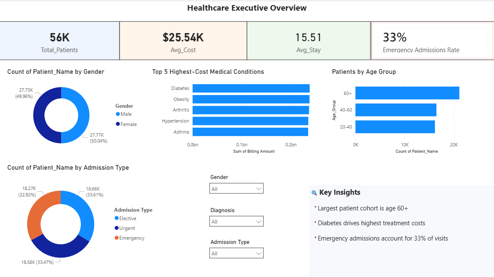
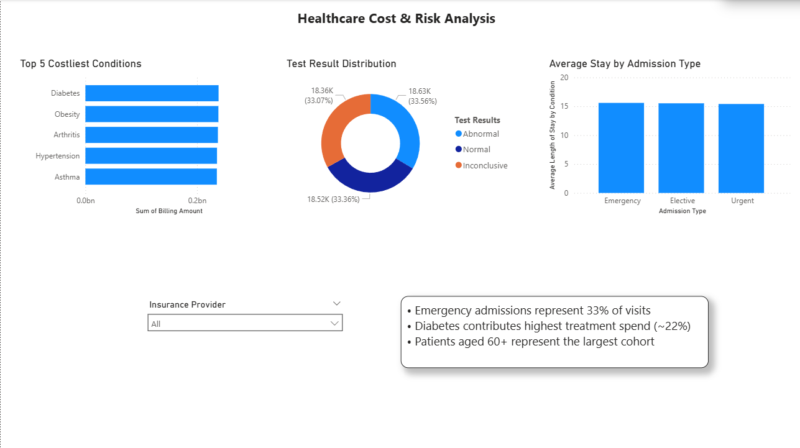

# Healthcare Analytics Dashboard (Power BI)

## Project Overview
Interactive 2-page Healthcare Analytics Dashboard built in Power BI to analyze 55K+ patient records, treatment costs, admission patterns, and healthcare risk metrics.

## Dashboard Features
- Executive KPI Overview
- Patient Demographic Analysis
- Admission Type Distribution
- Treatment Cost Analysis
- Cost & Risk Analysis Dashboard
- Dynamic Filters / Slicers
- DAX Measures & KPI Cards

## Tools Used
- Power BI
- Power Query
- DAX
- Excel / CSV

## Key Insights
- 56K patient records analyzed
- Avg treatment cost: $25.54K
- Emergency admissions: 33%
- Diabetes shows highest treatment costs
- 60+ age group represents largest patient cohort

## Dashboard Preview
### Executive Overview

### Cost & Risk Analysis

## Files Included
- healthcare.pbix
- healthcare_dataset.csv
- dashboard screenshots

## Skills Demonstrated
Data Cleaning | Data Modeling | DAX | Interactive Dashboarding | Healthcare Analytics
